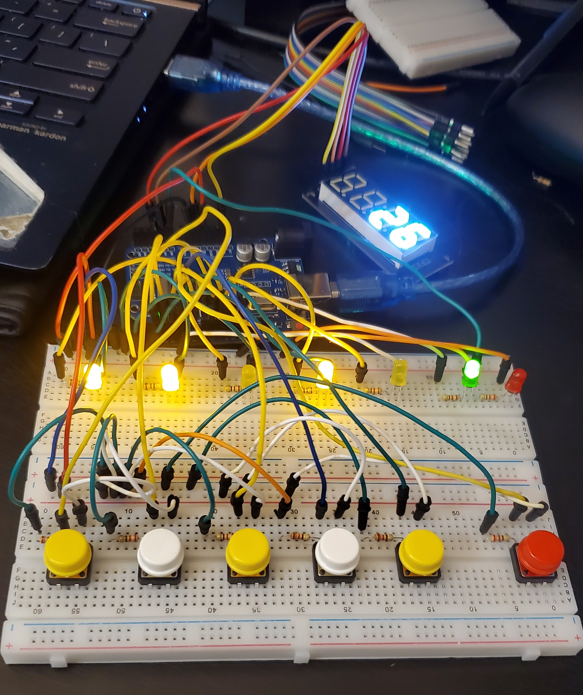

# kode-binary-arduino

Convert randomly generated numbers to binary code using an Arduino UNO board along with hardware components and TM1637 LCD display.

## Youtube Tutorials

LED + Button montage: https://www.youtube.com/watch?v=yBgMJssXqHY  
LCD TM1637 Digit Display: https://www.youtube.com/watch?v=6W7tycX-F1o

## Circuit Media

